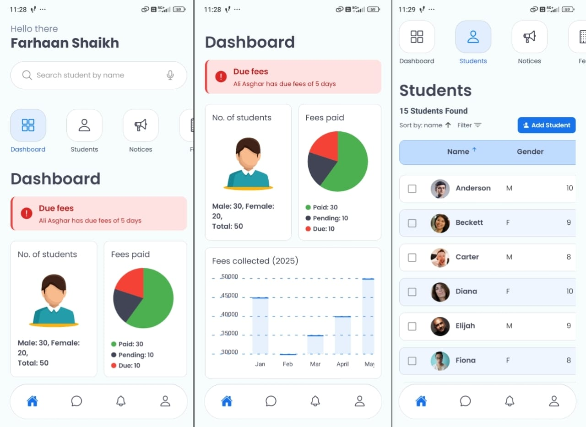
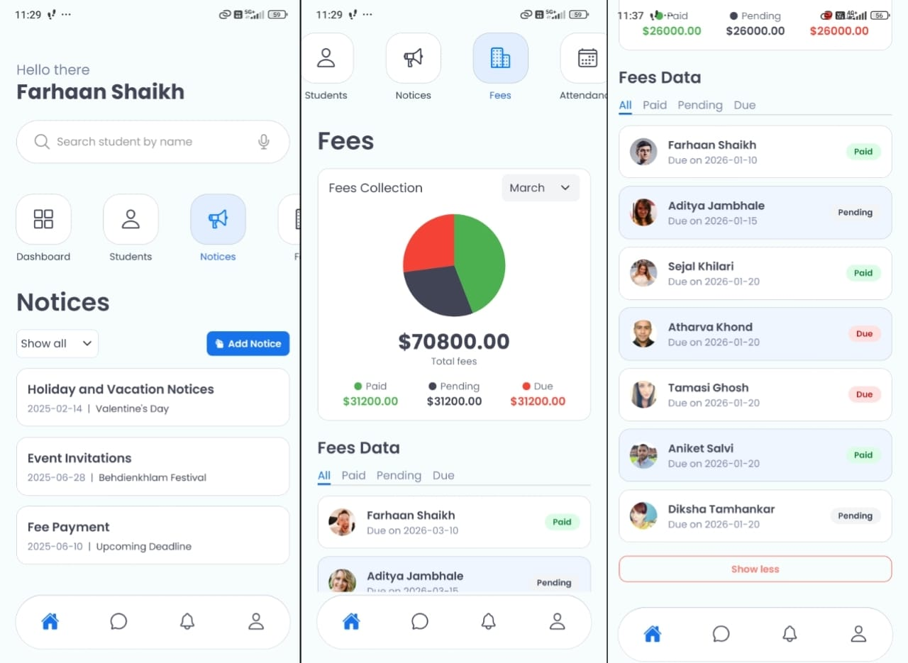
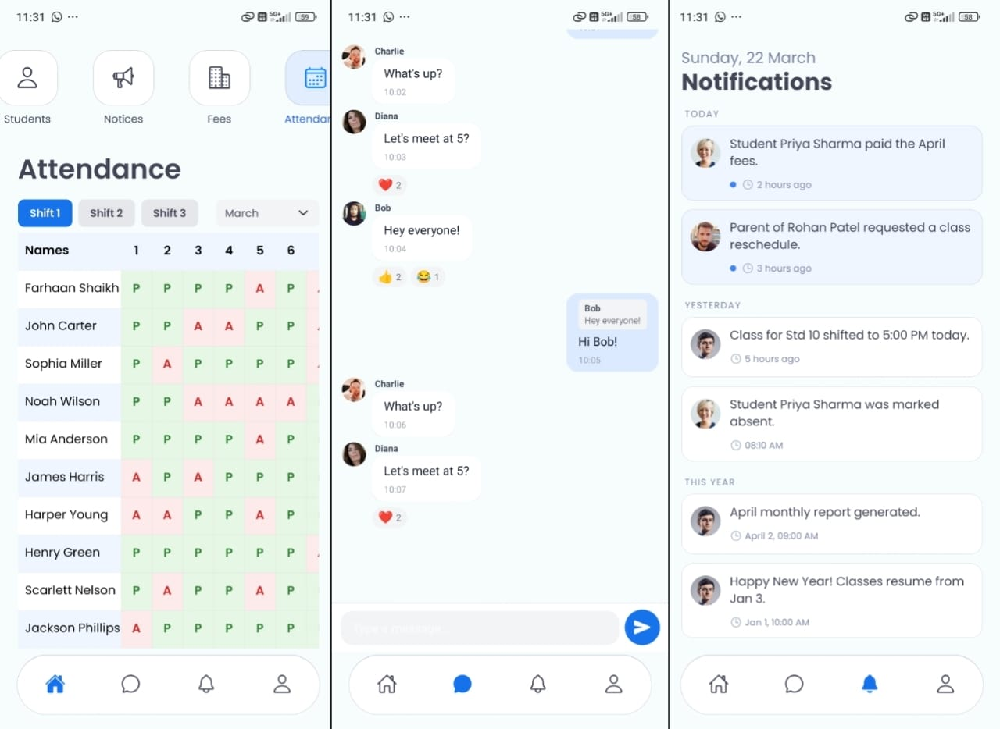

# 🎓 Smartminds

---

## 📖 Description

Smartminds is a **student management mobile application built with Expo (React Native)** designed for educational institutes and tutors to efficiently manage student data, fees, attendance, and communication.

It acts as a **centralized admin dashboard on mobile**, allowing administrators to track everything from student records to payments and notices in real-time.

With built-in **notifications and chat functionality**, Smartminds ensures seamless communication between admins and parents, making day-to-day operations smoother and more organized.

---

## ✨ Features

* 📊 **Admin Dashboard**
  Get a quick overview of students, fees, and attendance in one place.

* 👨‍🎓 **Student Management**
  View complete student details and add new students easily.

* 💰 **Fees Tracking**
  Monitor paid and pending fees with structured records.

* 📅 **Attendance Management**
  Mark and view student attendance efficiently.

* 📢 **Notices System**
  Admins can upload notices that are instantly visible to parents.

* 💬 **Real-time Chat (Firebase)**
  Enable direct communication between admin and users.

* 🔔 **Smart Notifications**
  Alerts for fee payments, pending dues, and important updates.

* 📱 **Mobile-First Experience (Expo)**
  Designed primarily for mobile usage with smooth UI/UX.

---

## 🚀 Installation (Expo App)

### 1️⃣ Clone the repository

```bash
git clone https://github.com/FSfarhaan/Smartminds.git
cd smartminds
```

---

### 2️⃣ Install dependencies

```bash
npm install
```

---

### 3️⃣ Run the app (Expo)

```bash
npx expo start
```

Then:

* Scan QR with Expo Go (Android/iOS)
* Or run on emulator

---

## 🛠️ Usage

1. Open the app as **Admin**
2. Manage **student records**
3. Track **fees and attendance**
4. Upload **notices**
5. Communicate via **chat**
6. Monitor updates through **notifications**

---

## 🧩 Tech Stack

### 📱 Frontend

* **React Native (Expo)** → Cross-platform mobile app
* **React Navigation** → Navigation and routing

### 🔥 Backend & Services

* **Firebase** → Realtime database & chat
* **Firebase Cloud Messaging (FCM)** → Push notifications

### ⚙️ Core Features Handling

* Student data management
* Fees & attendance tracking logic
* Notice system & updates

### 📦 State Management

* Handles app-wide state for students, fees, attendance, and chat

---

## 🤝 Contributing

Contributions are welcome!

If you’d like to improve:

* UI/UX
* Performance
* Feature enhancements

Feel free to open an issue or submit a PR.

---

## 📸 Screenshots

<!-- Add screenshots here -->





---

## 📬 Contact

📧 [farhaan8d@gmail.com](mailto:farhaan8d@gmail.com)
🔗 [https://www.linkedin.com/in/fsfarhaanshaikh](https://www.linkedin.com/in/fsfarhaanshaikh)
